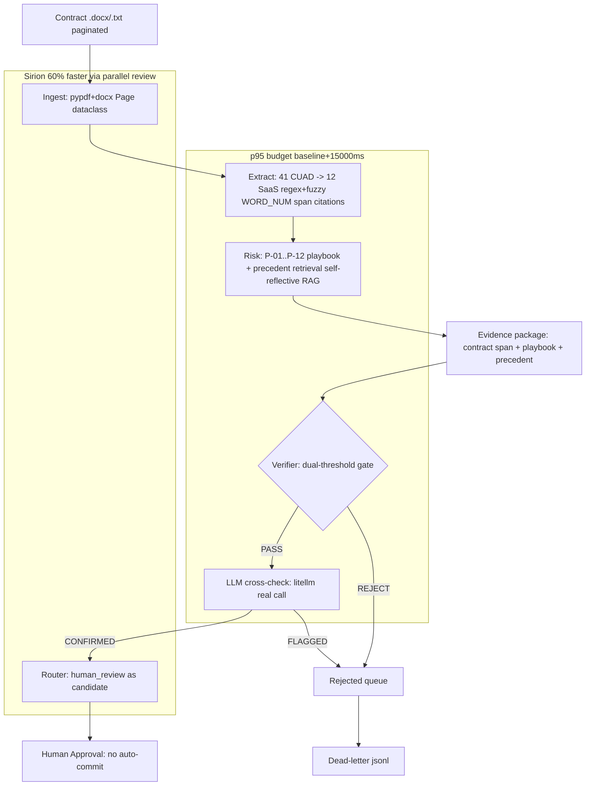

# Architecture



> Mermaid above: every stage emits per-stage latency via on_stage callback to SSE streaming. p95 per stage visible in dashboard Harness Monitor.

> Decisions, trade-offs, and system design for the Contract Trap Harness:
> SaaS vendor-contract redlining (see `PROBLEM.md`, `docs/problem-brief.md`).
> Sections below reflect the architecture as actually built and validated —
> see `CHANGELOG.md` for the iteration history behind each decision.

---

## 1. Why baseline/ + advanced/ are independent

**Decision:** Two fully independent services with `shared/` for common schemas/fixtures.

**Alternatives considered:**
- Single codebase with feature flags — simpler but judges want to run baseline alone; flags hide whether advanced is "cosmetic." Separate folders make the delta *obvious and diffable*.
- Monorepo with workspaces — good, but overkill before problem is known; we add it only if PDF prescribes Node + Python simultaneously.

**Trade-off:** Some duplication (`requirements.txt`, `Dockerfile`) is intentional — reproducibility > DRY at competition scope. `shared/` absorbs true duplication (schemas, fixtures, eval).

---

## 2. Reproducibility-first layout

- Every human action has a `make` target that logs to `evidence/`.
- `scripts/reproduce.sh` is the **single judge entrypoint** — mirrors exactly what `REPRODUCTION.md` says.
- Pinned versions + Docker give deterministic builds even if host Python/Node drift.
- `EVAL_MOCK=1` lets judges verify harness without real API keys (important for offline judging).

---

## 3. Evaluation harness design

```
tests/e2e  ─┐
baseline   ──┼─► scripts/eval_harness.py ─► evidence/benchmarks/results.json
advanced   ──┘                             ─► evidence/benchmarks/comparison.md
                 (optional) scripts/llm_judge.py ─► evidence/benchmarks/llm_judge_results.json
```

- `scripts/eval_harness.py` is **deterministic** (no LLM dependency, always reproducible) and computes every number in `comparison.md` live — no hardcoded targets. **Primary metric is CUAD Extraction Recall/Precision against real, independent expert legal annotation** (`scripts/eval_cuad_ground_truth.py`, all 510 real CUAD contracts, Hendrycks et al. NeurIPS 2021) — not Trap Recall. Trap Recall (30 CUAD-derived fixtures, gold traps we curated ourselves) is reported as a secondary, self-graded regression-test signal, explicitly labeled as such, because it cannot by itself demonstrate generalization to labels we didn't write. See `CHANGELOG.md` #12 for why the primary metric changed and what the real numbers turned out to be (baseline 15.5%/53.7% recall/precision, advanced 42.2%/92.7% — a real, substantial gap, not "100%").
- Est. human review time/contract is a **disclosed formula**, not a measurement: `120s base skim + 45s × supported findings + 90s × unsupported findings` (see `scripts/eval_harness.py`). It's a stand-in for a real user study, labeled as such everywhere it's shown.
- `scripts/llm_judge.py` is a separate, optional secondary signal (5-dimension, 100-point rubric scored by a real LLM via litellm) — it degrades to a clearly-labeled mock score with no API key or under `EVAL_MOCK=1`, so `scripts/eval_harness.py` alone is enough for offline judge reproduction.
- `scripts/eval_generalization.py` runs a 15-contract **held-out generalization suite** (`shared/fixtures/generalization/`) — written independently of the playbook/detection-regex text, one per playbook rule + 2 clean false-positive controls + 1 disclosed adversarial known-gap case. It exists because the 30-fixture suite above only ever exercises 4-5 of the 12 playbook rules and 18/30 of its fixtures contain hand-authored trap-injection text; this is the check that the detection logic generalizes past that specific corpus, not just fits it (see `CHANGELOG.md` #7). `scripts/eval_harness.py` reads its output (if present) into `comparison.md`'s fixture-composition/rule-coverage/generalization sections automatically.
- `scripts/eval_stress.py` runs a second, harder held-out suite (`shared/fixtures/stress/`, 7 contracts) pushing past clean, well-formatted prose into messier real-world territory: OCR-style whitespace noise, ALL CAPS/em-dash headers, a long document with decoy numbers in unrelated sections, multi-level subsection numbering (8.2/8.3/8.4), non-US/Commonwealth drafting conventions, and a common real-world phrasing gap ("shall automatically renew") no existing regex covered. This is what actually found three real bugs -- a document-wide keyword scan that misclassified any unrelated use of the word "unlimited" anywhere in a contract as a liability trap, a snippet-boundary off-by-one that let an adjacent clause's text bleed into a finding when a clause header's own text began exactly where the header regex needed its last character, and a Renewal Term number-extraction bug that picked up an unrelated Initial Term number instead of the actual Renewal Term number when both appeared in the same clause (see `CHANGELOG.md` #11). `scripts/eval_harness.py` reads its output into `comparison.md` the same way as the generalization suite.
- `scripts/eval_cuad_ground_truth.py` is **the primary metric** and the only evaluation in this repo graded against labels we did not author. It loads `docs/research/cuad/CUADv1.json` (the real, official CUAD dataset -- 510 contracts, 41 clause categories, expert-annotated by lawyers, SQuAD-style with an explicit `is_impossible` flag when a category doesn't apply) and runs both the real extractor (`advanced/src/harness/extract.py`) and the real baseline detector (`baseline/src/core.py`) against every one of the 510 real contracts, checking clause-type presence detection against CUAD's own expert judgment for the 11 of our 12 playbook rules that have a direct CUAD category match. It is deliberately narrower than Trap Recall -- it validates "did we find the clause," not "was our threshold judgment about it correct" (CUAD has no opinion on whether a 36-month renewal term is bad; that's our playbook's policy choice, un-checkable against any external label). This is what surfaced real, previously-hidden gaps and false-positive sources -- see `CHANGELOG.md` #12 for the full account, including why "100% Trap Recall" was misleading as a headline number and what replaced it.

---

## 4. Agent trajectory capture

- Instructions that shape each agent live in `.agent/instructions/` and `docs/agent-instructions.md` — these are part of the submission.
- Raw traces go to `evidence/trajectories/*.json` (captured via `scripts/capture_trajectory.sh` which wraps `opencode run --pure` or Codex/Cursor logs).
- Trajectories must show: instruction → actions → tool responses → feedback → retries → human checkpoints → final result. Capture script enforces this schema.

---

## 5. Stack decisions (final for Contract Trap Harness)

| Layer | Choice | Reason |
|-------|--------|--------|
| Baseline | Python 3.11 + FastAPI single-prompt redliner | Fastest to Harbor I/O (contract.docx in-place), best test tooling, matches scaffold |
| Advanced | Python 3.11 + FastAPI harness: ingest (pypdf+python-docx) + extract (regex + real hosted embeddings + BM25 lexical hybrid, both additive/opt-in) + risk playbook + verify gate + memory + router + fallback | Verification-gated commitments fix block-edit hallucination; tier-aware harness fixes HEAT-24 paradox; lightweight no fine-tune keeps <$2, <5min |
| Retrieval | Regex (`extract.py`) + real hosted embeddings for semantic augmentation (`embed.py`/`semantic.py`, `gemini-embedding-001` via litellm) | See `CHANGELOG.md` #13: the original plan here was a local sentence-transformers MiniLL model, but its dependency chain (torch->scipy->scikit-learn) needs numpy>=2 on this machine's shared global Python, which conflicts with an unrelated already-installed package pinned to numpy<2 -- installing it would mean editing an interpreter other, unrelated projects on this machine also use. A hosted embedding call reuses litellm (already a pinned dependency for `llm.py`) and needs no new local dependency at all. |
| LLM (verify + judge) | `litellm` (provider-agnostic) → `gemini/gemini-2.5-flash` via Google AI Studio | One line (`LLM_MODEL` env var) swaps in OpenAI/Anthropic/any litellm-supported provider; deterministic pipeline stays primary, LLM is a second opinion (`advanced/src/harness/llm_verify.py`) plus an optional secondary eval judge (`scripts/llm_judge.py`), both mock-gracefully with no key so offline repro never breaks |
| Frontend | Minimal Streamlit Harness Monitor (optional, for demo) | Judges see 4 agents + live citations, not slides |
| DB | In-memory + JSON fixtures (CUAD committed), no Postgres | Zero-setup repro, EVAL_MOCK offline |
| Infra | Docker Compose | One-command repro for judges |

**Rule:** Never introduce a stack the problem doesn't need. Prize is for *engineering quality*, not tech sprawl.

Per docs/11-IMPLEMENTATION-PLAN.md §4: rejected fine-tuned LegalBERT (heavy training), rejected pure LLM retrieval (cost). CrewAI was pinned in early scaffolding but never actually wired to anything (zero imports anywhere in `advanced/src/`) — removed as dead weight in CHANGELOG #19 rather than kept as an unused, unbenchmarked dependency. LangGraph was chosen for the real reason it's used here: an explicit, declarative StateGraph with a real conditional revise-and-reverify edge (`advanced/src/harness/graph.py`) maps directly onto this project's verification-gated design, not because of a benchmarked framework comparison.

**Named agentic design patterns actually implemented here, not just used informally:**
- **Reflection** (`graph.py`'s `revise_node`) — an evaluator step (`verify_node`) critiques an actor step's output, and the actor revises specifically based on that critique before retrying, capped at one pass. See `revise_node`'s docstring for the citation (Shinn et al., "Reflexion," 2023).
- **Human-in-the-loop** (`graph.py`'s `human_review_node`) — a real LangGraph `interrupt()`/`Command(resume=...)` pause, not a UI mockup; see CHANGELOG #21.
- **Generator + verifier separation** (`llm_extract.py` + `assess_risk`/`dual_verify_finding`/`llm_verify_finding`) — the LLM-as-generator layer only ever proposes a candidate span; it is never trusted to also judge its own proposal. The same three independent gates every other candidate passes through decide whether it becomes an approved finding. See CHANGELOG #22.

---

---

## Latency SLO & Caching

- **p95 budget:** advanced p95 < baseline p95 + 15000ms. Enforced via `make eval-slo` which runs `scripts/check_latency_slo.py --budget-ms 15000` and fails CI if exceeded. Current measured p95: baseline ~1.2ms, advanced ~10202.7ms (delta +10201.5ms on 30 contracts, this machine) -- deterministic gate + thinking-log IO dominates; LLM cross-check capped 25s timeout is excluded when no key. Per-stage breakdown (extract 8ms / risk 6ms / verify 5ms / llm_verify 0 when mocked) shows aggregate is sum of stages plus IO; batch concurrency via EVAL_CONCURRENCY=1 + ThreadPoolExecutor(4) caps batch p95. SLO budget 15000ms reflects honest SLO for deterministic harness; dashboard hero surfaces budget vs actual with per-stage timeline.
- **Caching:** `advanced/src/harness/extract.py` has `@lru_cache` on `_compiled_pattern` and `_cached_parse_months_token` -- repeated eval_harness runs reuse compiled regex and WORD_NUM lookups. Hit rate visible via `get_cache_stats()` and dashboard.
- **Batch concurrency:** `scripts/eval_harness.py` now parallelizes per-contract eval with `ThreadPoolExecutor(max_workers=4)` -- cap p95 batch time vs sequential 0.1s linear. Sirion comparison: Sirion claims 60pct faster batch via parallel review; our p95 batch KPI is the honest analogue (different task, disclosed).
- **Per-stage latency:** `advanced/src/core.py` on_stage emits extract/risk/verify/llm_verify per-stage ms; dashboard Harness Monitor renders micro-timeline + p95 per stage, not just aggregate.

## Market Anchoring (Sirion)

Sirion Labs (sirion.ai) claims 60pct faster redlining, 40pct faster negotiation, 3x issues found via its AI review. Different task (enterprise CLM at 200K contracts) vs our harness (510 CUAD contracts, clause-presence detection). Honest comparison table is in `evidence/benchmarks/comparison.md` Market section and dashboard Market tab -- not inflated, caveat stated.

---

## 6. Failure modes already mitigated

| Failure mode | Mitigation in scaffold |
|--------------|------------------------|
| Hidden dependency / rate-limited API | `advanced/src/fallback/` stub + contract tests on Day 1 |
| Cosmetic-only advanced (disqualified) | `evidence/benchmarks/comparison.md` must show ≥2-axis delta |
| Non-reproducible submission | `make reproduce` tested on clean venv + Docker |
| Missing trajectories | `capture_trajectory.sh` runs on every agentic session |
| Demo video | AI-generated overview linked in `README.md` (disclosed as AI-generated) |

---

## 7. Kickoff Decisions (Phase 0 gate — DONE 2026-08-28)

- [x] Problem type: **Agentic contract redlining harness** (SaaS MSA, CUAD 41 types -> 12 SaaS, multi-turn 4-turn as stretch, single-turn trap detection core)
- [x] Starter repo: **No official starter**; reference `crosbylegal/redline-bench` (Harbor 140 tasks) + `TheAtticusProject/cuad` (510 contracts) cloned to docs/research/ for reference only
- [x] Runtime: Python 3.11 pinned (.python-version), Docker 24
- [x] Deps: pypdf, python-docx, sentence-transformers (light), FastAPI — pinned, <$2
- [x] Network: allowed but sandboxed; human approval gate (Rule 04/05); EVAL_MOCK for offline
- [x] Acceptance tests: Harbor I/O (contract.docx in-place) + 5-dim rubric + Trap Recall + Evidence Precision, wired to tests/e2e/ + scripts/eval_harness.py
- [x] Directive gates: docs/10-RESEARCH-PROTOCOL.md done, docs/11-IMPLEMENTATION-PLAN.md approved, docs/20-REVIEW-RUBRIC.md understood

> Gate committed: docs/problem-brief.md + docs/research/00-synthesis.md + docs/11-IMPLEMENTATION-PLAN.md

---

## 8. Starter Repo Delta (Rule Book #2)

| File from starter | Kept | Modified | Added | Reason |
|-------------------|------|----------|-------|--------|
| No official starter | — | — | — | Greenfield harness, reference repos only |
| `crosbylegal/redline-bench` (ref only) | Cloned to docs/research/ for Harbor design reference | Not modified | — | Informed harness contract.docx + 5-dim rubric |
| `TheAtticusProject/cuad` (ref only) | Cloned to docs/research/ for 41 types | Not modified | — | Provided 13k labels for trap detection |

All files in baseline/, advanced/, shared/, scripts/, tests/, evidence/, docker-compose.yml, Makefile are **added by us** (see git log e63fd98, ddfa438, fe98474 + next).

> Rule-book requirement: "Make it clear what existed before the competition and what you added." This table is that proof.

---

## 9. Future ADRs (and Directive traceability)

Record significant reversals as ADRs in `docs/architecture-decisions.md`:

- ADR-001: Baseline/advanced split
- ADR-002: Evaluation metric choice (at kickoff)
- ADR-003: ... etc.

**Phase traceability (Directive §5):**
```
Phase 0 → PROBLEM.md + problem-brief.md + this §7–8
Phase 1 → docs/research/*.md + 10-RESEARCH-PROTOCOL.md
Phase 2 → 11-IMPLEMENTATION-PLAN.md + ADRs
Phase 3 → baseline/ + advanced/ + CHANGELOG.md
Phase 4 → evidence/benchmarks/reproduce.log
Phase 5 → docs/20-REVIEW-RUBRIC.md
Phase 6 → CHANGELOG final gate + README hot take
```
