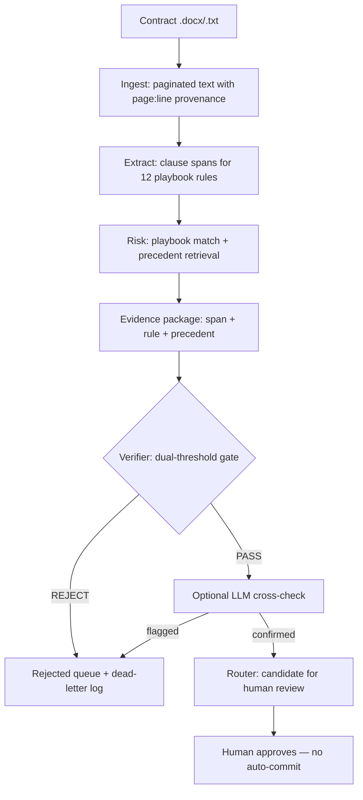
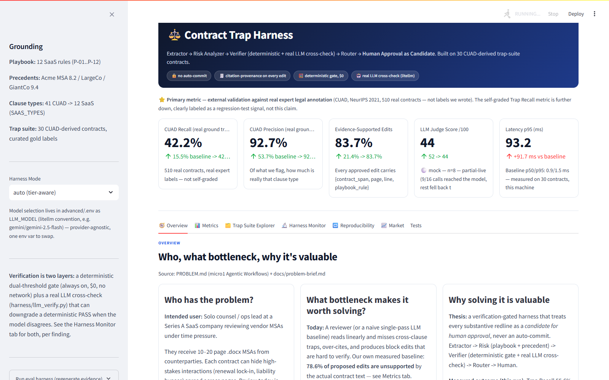
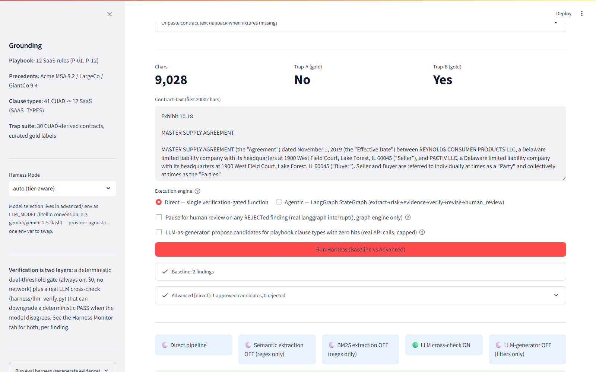
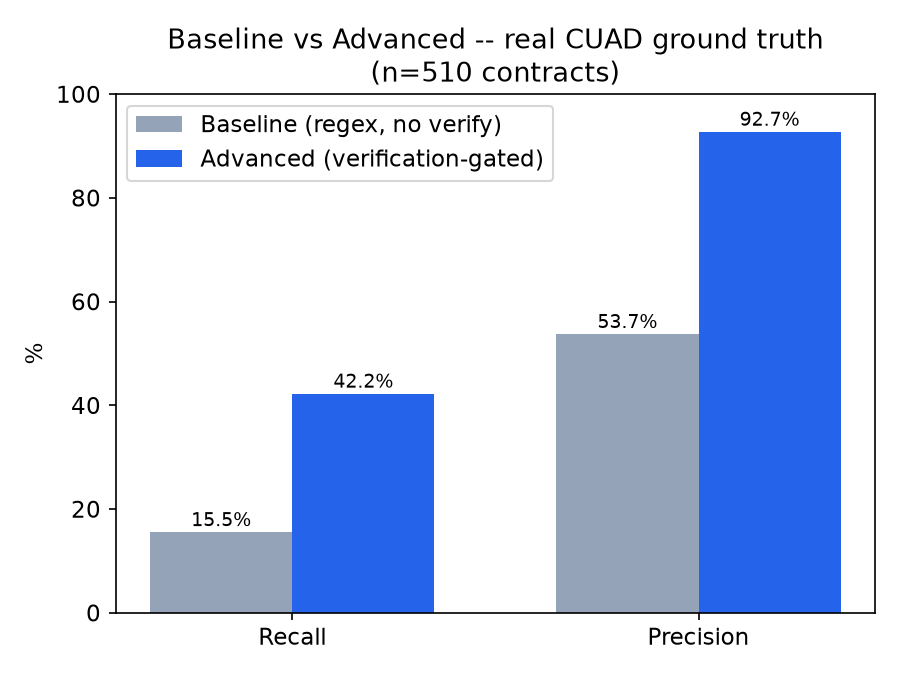
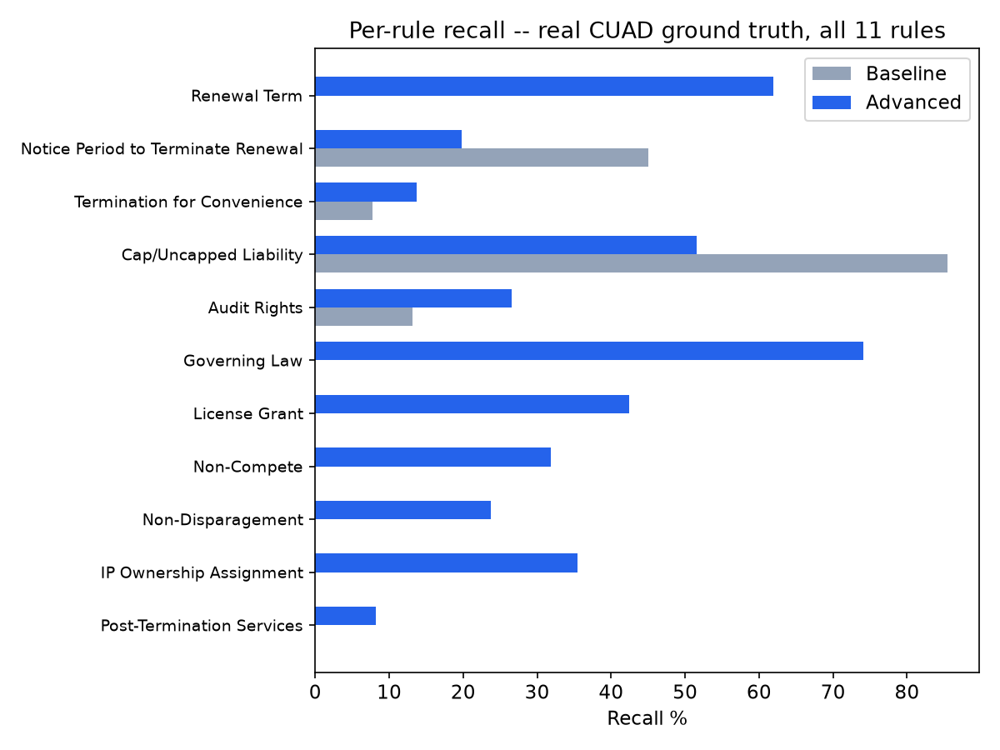

# Contract Trap Harness

[](LICENSE)
[](.python-version)
[](REPRODUCTION.md)

A **verification-gated redlining harness** for SaaS vendor contracts. Given a contract,
it extracts clause types, flags the ones that match a 12-rule risk playbook, and only
surfaces a proposed redline once it passes a deterministic dual-threshold evidence gate
plus an optional live LLM cross-check — never an auto-commit. A single-pass baseline
detector ships alongside for direct comparison.

Every number below is computed by a `make`-reproducible script against real data
(510 expert-annotated [CUAD](https://github.com/TheAtticusProject/cuad) contracts),
not asserted. See [`evidence/benchmarks/comparison.md`](evidence/benchmarks/comparison.md).

> 🎬 **Demo video (AI-generated overview):** https://youtu.be/OSG8LzI_w_Y
> *Note: the video is AI-generated from this repo's real evidence files — a visual
> walkthrough, not a recording of a live run. To see the system run for real,
> use the dashboard below.*

---

## Table of Contents

1. [Who this is for](#who-this-is-for)
2. [Quick start](#quick-start)
3. [How it works](#how-it-works)
4. [Usage](#usage)
5. [Results](#results)
6. [Limitations](#limitations)
7. [Repository structure](#repository-structure)
8. [Documentation](#documentation)
9. [Contributing](#contributing)
10. [License](#license)

---

## Who this is for

Solo counsel or an ops lead at a SaaS company reviewing vendor MSAs: someone who must
catch cross-clause traps (e.g. a 24-month auto-renewal paired with a 30-day termination
notice, or a liability cap quietly bypassed by carve-outs) across dozens of pages under
time pressure. The harness reduces estimated review time **4.5 → 3.0 min per contract**
(disclosed formula, not a user study) while catching **42.2% of real clause types vs
15.5% for the baseline** on 510 real CUAD contracts — and every approved edit carries
its `{contract_span, page:line, playbook_rule}` citation so a human reviewer can check
it directly.

*Origin: built for the micro1 Frontier Engineering Challenge 2026 (Agentic Workflows
Hackathon). The challenge brief and judging context are preserved in
[`PROBLEM.md`](PROBLEM.md) and [`docs/`](docs/).*

---

## Quick start

**Prerequisites:** Python 3.11, Make, Git. Docker optional. No API key needed.

```bash
git clone https://github.com/Shashwat1729/contract-trap-harness.git
cd contract-trap-harness
make setup          # creates .venv, installs baseline + advanced + dashboard deps
cp .env.example .env

make test           # baseline + advanced + dashboard smoke + e2e (offline, $0)
make eval           # 30-contract trap suite → evidence/benchmarks/
make reproduce      # full clean-room check — what reviewers run
```

To try the live LLM paths (cross-check, judge), add a key to `.env`:

```bash
GEMINI_API_KEY=...   # or OPENAI_API_KEY / ANTHROPIC_API_KEY
LLM_MODEL=gemini/gemini-2.5-flash
EVAL_MOCK=0
```

Without a key everything degrades gracefully to the deterministic offline path —
`make reproduce` is always $0. Full details: [`REPRODUCTION.md`](REPRODUCTION.md).

---

## How it works



**Key design choices** (see [`ARCHITECTURE.md`](ARCHITECTURE.md) for the full account):

- **Verification gates commitments.** A finding only becomes an approved candidate if
  its citation provably exists in the contract text. Hallucinated spans are rejected
  before a human ever sees them as candidates.
- **Two independent layers, honestly named.** A deterministic dual-threshold gate
  (always on, $0) plus an LLM cross-check (only with a key; mock-degrades offline).
- **Surgical, not block edits.** Proposed changes are word-level diffs with rationale,
  comments, and confidence — the output reads like a reviewer's markup, not a rewrite.
- **Tier-aware harness.** Frontier chat models get a lighter harness (verbosity hurts
  them); smaller models get the full gate — following the HEAT-24 finding.
- **A real agentic mode exists.** `advanced/src/harness/graph.py` implements the same
  pipeline as a LangGraph `StateGraph` (extract → risk → evidence → verify → revise →
  human_review, with checkpointing and a real `interrupt()` pause). It is opt-in
  (`ENABLE_LANGGRAPH=1`); the direct pipeline is the certified default.

---

## Usage

### API services

```bash
make run-baseline    # :8000 — single-pass reference detector
make run-advanced    # :8001 — verification-gated harness
```

```bash
curl -X POST http://localhost:8001/api/redline \
  -H 'Content-Type: application/json' \
  -d '{"contract_text": "<full contract text>", "contract_id": "msa_01", "party": "AgentCo", "turn": 1}'
```

### Dashboard

```bash
streamlit run app/streamlit_app.py   # or: make harness-monitor
```

Seven tabs: overview, metrics, trap-suite explorer, harness monitor (live run with
per-stage citations), reproducibility, market comparison, and tests.




### Evaluations

```bash
make eval                       # 30-contract trap suite (offline, deterministic)
make eval-cuad-ground-truth     # PRIMARY: 510 real CUAD contracts (auto-downloads dataset once)
make eval-generalization        # 15 held-out contracts, one per rule
make eval-stress                # 7 messy real-world formatting cases
make charts                     # regenerate README charts from evidence JSON
```

---

## Results

Primary metric — clause-type presence detection on **510 real CUAD contracts**
(Hendrycks et al., NeurIPS 2021), graded against expert labels we did not write:

| System | Recall | Precision |
|---|---|---|
| Baseline | 15.5% | 53.7% |
| **Advanced** | **42.2%** | **92.7%** |

Secondary diagnostics (30-contract trap suite, same cases for both):

| Metric | Baseline | Advanced |
|---|---|---|
| Trap recall | 56% | **100%** |
| Evidence-supported edits | 57.1% | **100%** |
| Unsupported edits | 42.9% | **0%** |
| Est. review time / contract | 4.5 min | **3.0 min** |

(Earlier revisions reported 83.7% / 16.3% for advanced. Every one of those "unsupported"
edits was a verifier bug — genuine verbatim spans past ~8,000 characters were checked
against a truncated copy of the contract and rejected as hallucinated — and baseline's
rate was inflated by a label mismatch. See CHANGELOG #26.)




Neighborhood check on the same dataset (stricter span-match metrics, not directly
comparable — see `comparison.md` for the caveat): fine-tuned DeBERTa-xlarge 47.8% AUPR,
zero-shot GPT-4.1 0.641 span-F1. Our zero-training rule system sits in a credible
neighborhood rather than an implausible one.

Full tables, per-rule breakdowns, latency (p50/p95), generalization (14/14) and stress
(7/7) suites: [`evidence/benchmarks/comparison.md`](evidence/benchmarks/comparison.md).
Regenerate everything with `make eval && make eval-cuad-ground-truth`.

---

## Limitations

Honest limits, all documented with evidence links in [`CHANGELOG.md`](CHANGELOG.md):

- **Regex/keyword extraction has a recall ceiling.** Broadly-worded CUAD categories
  still sit under 30% recall for some rules; semantic retrieval is opt-in and
  preliminary (validated on a small sample).
- **Trap suite is partly curated.** 18/30 fixtures contain disclosed hand-authored
  trap-injection text; it is a regression signal, not generalization proof — that is
  what the CUAD primary metric and the held-out suites are for.
- **Review-time is a formula**, not a user study: 120s skim + 45s/supported finding +
  90s/unsupported finding.
- **Live LLM paths need quota.** Free-tier caps (~20 req/day) blocked several runs
  during development; each is disclosed in the changelog with a re-run command.
- **Single-turn scope.** Multi-turn negotiation memory exists but the certified
  evaluation is single-turn trap detection.

---

## Repository structure

```
contract-trap-harness/
├── baseline/      # single-pass reference detector (FastAPI :8000)
├── advanced/      # verification-gated harness (FastAPI :8001)
├── shared/        # schemas + fixtures shared by both
├── app/           # Streamlit monitoring dashboard
├── scripts/       # reproducible entry points (eval_*, setup, reproduce)
├── tests/         # cross-cutting e2e (in-process, no live services)
├── evidence/      # committed benchmark outputs — the project's memory
├── docs/          # background + design docs (docs/archive: hackathon process notes)
├── .agent/        # agent instructions + trajectory records
├── docker-compose.yml
├── Makefile
└── .env.example
```

`baseline/` and `advanced/` are fully independent — `cd baseline && pytest tests`
works without touching `advanced`.

---

## Documentation

- [`ARCHITECTURE.md`](ARCHITECTURE.md) — design, trade-offs, latency SLO, market anchoring
- [`REPRODUCTION.md`](REPRODUCTION.md) — clean-environment setup, versions, cost
- [`CHANGELOG.md`](CHANGELOG.md) — 24 evidence-linked iterations (what failed, what changed, what it taught)
- [`docs/problem-brief.md`](docs/problem-brief.md) — problem definition
- [`docs/evaluation-criteria.md`](docs/evaluation-criteria.md) — benchmark methodology
- [`docs/11-IMPLEMENTATION-PLAN.md`](docs/11-IMPLEMENTATION-PLAN.md) — technical plan
- [`docs/research/00-synthesis.md`](docs/research/00-synthesis.md) — research background

---

## Contributing

See [`CONTRIBUTING.md`](CONTRIBUTING.md). TL;DR: branch from `master`, keep
`make reproduce` green, test alongside code (80% coverage gate), no secrets in git,
every claim links to `evidence/`.

---

## License

MIT — see [`LICENSE`](LICENSE). CUAD evaluation data is CC BY 4.0 (The Atticus Project)
and is downloaded on first use, not redistributed.
