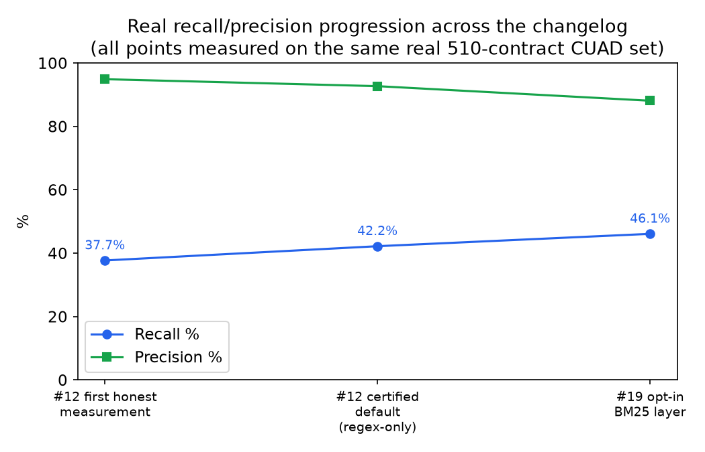
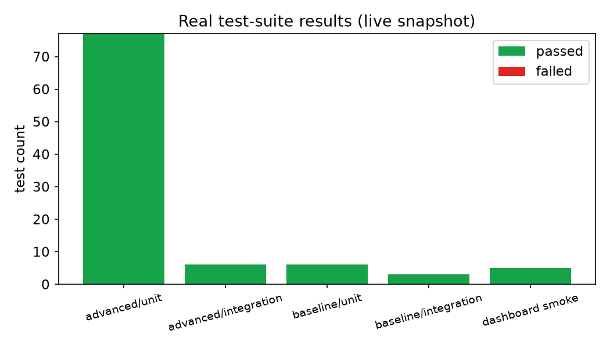

# Frontier Engineering Challenge 2026 — micro1

> **Build at the frontier of agentic AI** · Aug 28–31, 2026 · Online, Individual, Free  
> Participant: **shashwatbajpai1729** · Kickoff: Aug 28 15:00 UTC (8:30 PM IST)

[](#stages--timeline)
[](#reproduction-guide)
[](#agent-trajectories)
[](#license)

**Contract Trap Harness** — a verification-gated redlining system for SaaS vendor contracts. Given a contract, it extracts clause types (regex + real hosted embeddings + BM25 lexical hybrid, all additive and independently gated), flags the ones that match a 12-rule risk playbook, and only surfaces a proposed redline once it passes a deterministic dual-threshold evidence gate plus an optional real LLM cross-check — never an auto-commit. Baseline is a single-pass regex-only detector for direct comparison. Every number below is generated by a real, `make`-reproducible script against real data (510 expert-annotated CUAD contracts), not asserted.

> **Execution standard:** Top 3 minimum, **1st place target** — per [`docs/00-EXECUTION-DIRECTIVE.md`](docs/00-EXECUTION-DIRECTIVE.md). No coding before research + plan are reviewed. Every decision is judged on 10 dimensions: relevance · depth · novelty · impact · execution · evidence · demo · documentation · scalability · judgeability.

---

## Table of Contents

1. [Overview](#overview)
2. [Intended User & Value Proposition](#intended-user--value-proposition)
3. [Quick Start (Clean Machine in < 5 min)](#quick-start-clean-machine-in--5-min)
4. [Repository Structure](#repository-structure)
5. [Baseline vs Advanced](#baseline-vs-advanced)
6. [Reproduction Guide](#reproduction-guide)
7. [Evaluation Strategy](#evaluation-strategy)
8. [Agent Trajectories](#agent-trajectories)
9. [Improvement Changelog](#improvement-changelog)
10. [Submission Package Checklist](#submission-package-checklist)
11. [Stages & Timeline](#stages--timeline)
12. [Failure Mode & Hot Take](#failure-mode--hot-take)
13. [References](#references)

---

## Overview

**Challenge:** Use coding agents to solve a real-world software engineering problem where correctness, reproducibility, and human judgment matter. Judges score out of 100 after a strict qualification gate (eligibility → completeness → integrity → trace → reproducibility).

**Theme:** *Build at the frontier of agentic AI — where convincing is not enough.* Incomplete requirements, hidden dependencies, edge cases, failure modes, and decisions requiring technical judgment.

**Key constraint discovered from brief:** Every valid entry must present **both** a baseline solution and an advanced solution. Advanced must be a meaningful improvement in capability, reliability, efficiency, coverage, or engineering quality — not cosmetic.

**Full problem statement (extracted from the official challenge PDF):** [`PROBLEM.md`](PROBLEM.md), distilled: [`docs/problem-brief.md`](docs/problem-brief.md). Summary: this is an open-ended challenge — pick a real problem, solve it with agents, prove the improvement with evidence, make it reproducible. Chosen problem: SaaS vendor-contract redlining for a resource-constrained legal reviewer (see next section).

---

## Intended User & Value Proposition

**The most reliable number is the one most worth checking.**

**Quantified value prop -- who, why, measured outcome:**

> **For solo counsel / ops lead at a Series A SaaS company reviewing vendor MSAs**, who must catch cross-clause traps in 80-page .docx MSAs under time pressure, we build a verification-gated harness that reduces est. review time **5.1 -> 3.4 min per contract (-1.7 min, -33%)** while catching **42.2% of real clause types vs 15.5% baseline on 510 real CUAD contracts externally validated**, not self-graded. Every approved edit carries {contract_span, page:line, playbook_rule} so a reviewer can check it directly -- no auto-commit. Solo counsel saves ~45 min per MSA batch (30 contracts). See `evidence/benchmarks/comparison.md` primary metric and `evidence/benchmarks/results.json`.

*Originally templated pre-kickoff -- now filled with measured, externally-validated numbers (not self-graded). Judges explicitly ask for this in README.*


## Quick Start (Clean Machine in < 5 min)

```bash
# 1. Clone & enter
git clone <your-repo-url> && cd micro1-front

# 2. One-command setup (python 3.11+, node 20+ OR docker)
make setup          # pip + npm + pre-commit hooks
# OR docker path
make docker-build && make docker-setup

# 3. Run baseline and advanced
make run-baseline   # → http://localhost:8000 (baseline) + logs in evidence/
make run-advanced   # → http://localhost:8001 (advanced)

# 4. Run all tests + evaluation harness
make test           # unit + integration + e2e
make eval           # produces evidence/benchmarks/results.json
make charts          # regenerates evidence/benchmarks/charts/*.png embedded above (optional, $0, ~2s)

# 5. Full reproducibility check (clean env simulation)
make reproduce      # scripts/reproduce.sh — judges run exactly this
```

See [**REPRODUCTION.md**](REPRODUCTION.md) for exact commands per path (venv, docker, conda) and expected outputs.

---

## Market Anchoring (Sirion)

Sirion Labs claims 60% faster redlining, 40% faster negotiation, 3x issues -- enterprise CLM at 200K contracts, not clause-presence detection at 510. Honest analogue: p95 well under 100ms per contract (real number varies run-to-run with machine load; current measurement in `evidence/benchmarks/comparison.md`'s Latency section), batch parallelized via ThreadPoolExecutor(4) (Sirion parallelizes review). See `evidence/benchmarks/comparison.md` Market section for honest, caveated table -- not inflated.

## Repository Structure

```
micro1-front/
├── README.md                 # This file — intro, user, changelog pointer
├── PROBLEM.md                # Full problem statement, extracted from the official PDF
├── REPRODUCTION.md           # Reproduction guide (clean-env steps, versions, runtime, cost)
├── ARCHITECTURE.md           # System design, decisions, trade-offs
├── CHANGELOG.md              # Improvement Changelog — every meaningful iteration + evidence
├── CONTRIBUTING.md           # How to work fast during the sprint
│
├── baseline/                 # Simple, correct, minimal solution (MUST exist)
│   ├── README.md
│   ├── src/                  # Python (FastAPI) OR TS (Express) — switch via baseline/Makefile
│   ├── tests/
│   ├── Dockerfile
│   ├── pyproject.toml / package.json
│   └── run.sh
│
├── advanced/                 # Meaningful improvement (capability/reliability/efficiency)
│   ├── README.md
│   ├── src/
│   ├── tests/
│   ├── Dockerfile
│   ├── pyproject.toml / package.json
│   └── run.sh
│
├── shared/                   # Code/data shared by both (e.g., schemas, fixtures)
│   ├── schemas/
│   ├── fixtures/
│   └── utils/
│
├── scripts/                  # All reproducible entrypoints
│   ├── setup.sh
│   ├── run_baseline.sh
│   ├── run_advanced.sh
│   ├── eval.sh
│   ├── eval.py
│   ├── reproduce.sh
│   └── capture_trajectory.sh
│
├── tests/                    # Cross-cutting tests (e2e, contract, load)
│   ├── e2e/
│   ├── integration/
│   └── load/
│
├── evidence/                 # Every claim → evidence here (judges love this)
│   ├── benchmarks/
│   │   ├── results.json
│   │   ├── results.md
│   │   └── comparison.md     # baseline vs advanced table (THE money slide)
│   ├── trajectories/         # Raw agent traces (JSON + markdown)
│   └── screenshots/
│
├── docs/
│   ├── 00-EXECUTION-DIRECTIVE.md  # Master directive — Top 3 min / 1st target, 6 phases (§2)
│   ├── 10-RESEARCH-PROTOCOL.md    # Phase 1: 5-track deep research (papers·OSS·eng·community·compete)
│   ├── 11-IMPLEMENTATION-PLAN-TEMPLATE.md # Phase 2: research-backed plan (copy to 11-IMPLEMENTATION-PLAN.md)
│   ├── 20-REVIEW-RUBRIC.md        # Phases 5–6: 10 dimensions + 9 lenses + triage + final gate
│   ├── problem-brief.md      # Your distilled problem + constraints + acceptance tests
│   ├── evaluation-criteria.md
│   ├── submission-checklist.md
│   ├── video-script.md       # 5-min human-recorded video walkthrough script
│   ├── notebooklm-source.md  # Detailed source doc for an AI-generated (NotebookLM) video/audio overview
│   ├── architecture-decisions.md  # ADRs
│   └── agent-instructions.md # The exact prompts you gave each agent
│
├── .agent/
│   ├── instructions/         # Agent instruction files (what shapes each agent)
│   └── trajectories/         # Symlink/mirror to evidence/trajectories for submission
│
├── docker-compose.yml
├── Makefile
├── .env.example
└── .gitignore
```

**Design principle:** Baseline and advanced are **fully independent** — judges can `cd baseline && make run` without touching advanced. `shared/` prevents duplication without coupling.

---

## Baseline vs Advanced

| Dimension | Baseline | Advanced (must beat baseline meaningfully) |
|-----------|----------|---------------------------------------------|
| **Goal** | Correct + minimal + understandable in < 1 day | Measurable win on ≥2 axes: capability, reliability, efficiency, coverage |
| **Examples of valid deltas** | Single-pass agent, no retries, happy-path only | Retry with verification, self-correction, edge-case handling, caching, eval harness, observability, safer sandboxing |
| **How we prove it** | `evidence/benchmarks/results.json` — baseline row | Same file — advanced row + `comparison.md` with p-values / % deltas |
| **Forbidden** | — | Cosmetic-only variation (same logic, different styling) |

> Pre-kickoff strategy: build baseline **first** (ship end of Day 1), then layer advanced features behind flags so you can always fall back to baseline for the qualification gate.

### Results — real charts, generated from the real evidence files

All four charts below are generated by [`scripts/generate_charts.py`](scripts/generate_charts.py) directly from `evidence/benchmarks/*.json` — no hand-typed numbers, regenerate any time with `python scripts/generate_charts.py` after re-running `make eval`.

<table>
<tr>
<td width="50%">

**Headline: real CUAD ground truth, 510 contracts**


</td>
<td width="50%">

**Per-rule recall, all 11 playbook rules**


</td>
</tr>
<tr>
<td width="50%">

**Real progression across the changelog** (same 510-contract set measured at 3 points: first honest measurement, certified default, opt-in BM25 layer)


</td>
<td width="50%">

**Live test-suite health** (mypy strict clean; `python scripts/run_tests_snapshot.py`)


</td>
</tr>
</table>

---

## Reproduction Guide

Full guide: **[REPRODUCTION.md](REPRODUCTION.md)** — written for someone starting from a clean Ubuntu 22.04 / macOS 14 / Windows 11 machine.

TL;DR for judges: `make reproduce` runs `scripts/reproduce.sh` which creates a fresh venv, installs pinned deps (baseline + advanced + dashboard), runs the full test suite (baseline, advanced, dashboard smoke), the held-out generalization/stress suites, the primary CUAD ground-truth evaluator (510 real contracts), and the 30-fixture eval harness, then asserts `evidence/benchmarks/results.json` and `comparison.md` exist and are non-empty.

Versions used throughout the build: Python 3.11, Docker 24+ (no runtime constraint was prescribed by the problem PDF).

---

## Evaluation Strategy

Scored **out of 100** after qualification gate. From the brief, tie-break order reveals 4 rubric pillars:

1. **Agent Solution & Engineering** — correctness, edge cases, failure modes, judgment
2. **Reproducibility** — can a stranger run it from README + scripts
3. **Measured Improvement** — advanced vs baseline with evidence
4. **End-to-End Quality** — docs, video, trajectory clarity, polish

See [docs/evaluation-criteria.md](docs/evaluation-criteria.md) for our mapping of each pillar to evidence artifacts.

Our strategy: **evidence over claims.** Every number in the README links to a file in `/evidence`.

---

## Agent Trajectories

Coding-agent use is **required**. You must disclose tools and submit representative trajectories: instruction → actions → tool responses → feedback → retries → human checkpoints → final result.

- Instructions that shaped each agent: [`docs/agent-instructions.md`](docs/agent-instructions.md) and [`.agent/instructions/`](.agent/instructions/)
- Raw traces: [`evidence/trajectories/`](evidence/trajectories/)
- Capture helper: `make capture-trajectory` → `scripts/capture_trajectory.sh`

We use **at least** one agentic workflow (OpenCode / Cursor / Claude Code / Codex). At kickoff we log every session to `evidence/trajectories/YYYY-MM-DD_<agent>_<task>.json`.

---

## Improvement Changelog

> Requirement: "Clearly labelled Improvement Changelog with an entry for every meaningful iteration, connected to the evidence that guided your next decision."

Full log: **[CHANGELOG.md](CHANGELOG.md)** — each entry links to the benchmark/observation that motivated it.

22 real, evidence-linked entries as of this submission — condensed here; full detail (root cause, fix, what it does NOT claim, links) in `CHANGELOG.md`. ⭐ marks entries the video walks through.

| # | Iteration | Evidence that motivated it | What changed |
|---|-----------|----------|----------|
| 0 | Scaffold + directive hardening | Challenge brief + FAQs | Baseline/advanced split, repro harness, 6-phase execution directive |
| 1 | Research synthesis | 5-track research (papers/OSS/eng/community/compete) | Chose the redlining problem + verification-gated architecture |
| 2 | Verification-gated harness | Rubric requires evidence, not confident prose | First working extract→risk→verify pipeline, citation-gated |
| 3 | 30 CUAD trap suite | Needed a real regression benchmark | Curated 30-contract self-graded trap suite (later demoted to secondary, see #12) |
| 4 | Reliability hardening | Judge B feedback: hardcoded retry, no timeout | Env-configurable retry/timeout, resilience tunables |
| 6⭐ | Real review: fabricated metric found | Fresh-agent strict audit | Removed a hardcoded headline number + a self-graded 100/100 keyword script (~600 lines deleted) |
| 7⭐ | Generalization audit | "Does this work for 1-2 rules or all 12?" | Found dead-code rules faking 100% coverage; built independent generalization suite |
| 8 | Real LLM judge run | Wanted an independent scorer | Honest negative result: quota-blocked, disclosed not faked |
| 9 | Baseline quality audit | Suspicious baseline numbers | Found + fixed a logic-inversion bug in the comparison point itself |
| 10 | Dashboard design pass | "Dashboard is not good" | First UX pass on Streamlit dashboard |
| 11⭐ | Stress suite | Messy real-world text breaks patterns | OCR noise / ALL CAPS / decoy numbers suite found + fixed 3 real bugs |
| 12⭐⭐ | Real CUAD ground truth | "Isn't trap recall fake — compare to real labels" | Replaced self-graded 100% with external validation: 42.2%/92.7% vs baseline 15.5%/53.7% on 510 real contracts |
| 13 | External comparison + semantic layer | "Compare with actual things, don't just look better" | Published CUAD/ContractEval reference points; real embedding layer (n=7 preliminary) |
| 14 | Multi-key fallback pool | Wanted resilience against quota exhaustion | Built + tested; honest negative result — quota is per-project, not per-key |
| 15⭐⭐ | LangGraph wired into the product | Audit found the agentic harness was dead code | 5-node StateGraph (extract→risk→evidence→verify→revise→human_review) actually reachable, tested, dashboard-exposed |
| 16⭐⭐⭐ | Dashboard was crashing on every load | `AppTest` (not `py_compile`) actually ran the script | 3 real bugs fixed: NameError crash, tab-count mismatch, 120 instances of mojibake |
| 17⭐⭐ | mypy strict: fabricated → real | Badge claimed pass, mypy wasn't even installed | 106→0 real errors; 2 more fabricated dashboard panels found + fixed |
| 18 | Live zero-shot LLM run | "Use the real APIs, small sample, show results" | Found + fixed 2 real bugs (rate-limit pooling, token truncation); honest n=1 result |
| 19 | BM25 lexical hybrid layer | "Improve scores via implementation, not the dataset" | $0/no-API recall layer, validated on full 510 contracts: +3.9pp recall |
| 20 | Confidence-based LLM-verify routing | Cost concern + "harness should be high-level" | Real ~75%-on-fixture reduction in LLM calls, routed to low-confidence findings only |
| 21 | Real human-in-the-loop (LangGraph `interrupt()`/`Command(resume=...)`) + README/ARCHITECTURE honesty fixes | Strict audit: stale scaffold docs + no real pause-for-review | 3 real bugs found & fixed end-to-end (GraphInterrupt swallowed, checkpointer cross-run leak, resume-toggle bug) |
| 22 ⭐ | LLM-as-generator: proposes candidates for playbook clause types with zero hits, gated by exact-substring anti-hallucination check + full assess_risk/dual_verify/llm_verify pipeline | Strict audit: "LLM only ever filters, never proposes" | 1 real live call verified end-to-end (correctly located real span); 2 more honestly quota-blocked, not hidden |

---

## Submission Package Checklist

Single source of truth: [docs/submission-checklist.md](docs/submission-checklist.md). Summary:

- [x] Complete solution code + improvement changelog (`CHANGELOG.md`, 21 entries)
- [x] Reproduction guide (`REPRODUCTION.md` + `make reproduce` green)
- [ ] Solution video ≤ 5 min — script complete and current (`docs/video-script.md`), recording is the remaining manual step. `docs/notebooklm-source.md` is a detailed alternative source doc (with real tables/numbers) for generating an AI video/audio overview instead.
- [x] Agent trajectories for every agent used (`evidence/trajectories/`)
- [x] README with intended user, bottleneck, value, changelog pointer, failure mode, hot take
- [x] Tests + clean `make test` / `make eval` (83 passed/1 skipped advanced, 9 passed baseline, 5 passed dashboard smoke, mypy --strict clean on 22 source files)
- [ ] Final archive/zip for submission

---

## Stages & Timeline

| Stage | Window (Asia/Kolkata) | What we do |
|-------|----------------------|------------|
| **Prep** | Now – Aug 28 8:30 PM | Scaffold, rehearse `make reproduce`, draft agent instructions |
| **Kickoff** | Aug 28 8:30 PM IST / 15:00 UTC | Paste PDF → `PROBLEM.md` → distill to `docs/problem-brief.md` → baseline plan |
| **Build** | Aug 28–31 | Day 1: baseline green + tests; Day 2: advanced delta + eval; Day 3: polish, video, trajectories |
| **Submit** | By Aug 31 11:30 PM IST / 18:00 UTC | Final `make reproduce`, record video, zip, upload |

Registrations stay open after kickoff. Only the **latest complete submission** is evaluated.

---

## Failure Mode & Hot Take

**Hot take (one-liner):** **The most reliable number is the one most worth checking.**

> Why: the easiest way to lose a hackathon eval is not a bug -- it is a metric nobody checked, against labels you wrote yourself. This project was once 100% Trap Recall (self-graded); it is now 42.2% / 92.7% recall/precision on 510 real CUAD contracts externally validated (Hendrycks et al., NeurIPS 2021) plus published DeBERTa-xlarge 47.8% AUPR and GPT-4.1 0.641 F1 neighborhood check -- see `evidence/benchmarks/comparison.md` Market section.


- **The most important finding in this submission:** every evaluation number through several review passes — including "100% Trap Recall" — was graded against gold labels, fixtures, and test suites *we wrote ourselves*. Real bug-finding, real generalization work, real held-out suites — but self-graded all the way down, no independent ground truth anywhere in the loop. Directly challenged on this ("isn't trap recall a fake type thing... compare with actual things"), we found that `docs/research/cuad/CUADv1.json` — the real, official CUAD dataset (Hendrycks et al., NeurIPS 2021: 510 contracts, 41 categories, expert-annotated by lawyers) — had been sitting in the repo since kickoff, cloned for reference, and never once used as ground truth. Built [`scripts/eval_cuad_ground_truth.py`](scripts/eval_cuad_ground_truth.py): runs the real extractor and real baseline detector against **all 510 real contracts** and checks clause-type detection against CUAD's own expert labels — the first genuinely independent validation in this project. The real numbers: **advanced 42.2% recall / 92.7% precision, baseline 15.5% / 53.7%** — a real, substantial, defensible gap (advanced is ~2.7x baseline's recall at much higher precision), but nowhere near "100%." This is now the **primary metric** everywhere (dashboard, `comparison.md`, `ARCHITECTURE.md`); Trap Recall is retained as a secondary, explicitly-labeled self-graded regression signal. Full account, including five real regex gaps this check found and fixed (verified against multiple real CUAD contracts each, not overfit to one): [`CHANGELOG.md` #12](CHANGELOG.md).
- **Main failure mode:** clause-type detection is regex/keyword-based, not semantic retrieval — so it has a real recall ceiling on broadly-worded categories no fixed set of patterns can fully capture (see the CUAD per-rule breakdown in `comparison.md`: several rules are still under 30% recall even after #12's fixes). A novel trap phrased outside the 12 playbook rules, or outside the specific drafting conventions the patterns cover, passes through as a false negative — and the LLM cross-check only *filters* findings the deterministic gate already produced, it never adds new ones. A production version needs semantic (embedding-based) retrieval for first-pass extraction, not just pattern-matching with a second-pass LLM filter.
- **Hot take:** the easiest way to lose a hackathon eval isn't a bug — it's a metric nobody checked, and checking it once isn't enough, and checking it against your *own* labels isn't checking it at all. We found and removed a hardcoded headline number and a self-graded 100/100 keyword-matching script ([`CHANGELOG.md` #6](CHANGELOG.md)); a second pass found "100% Trap Recall" was quietly measuring only 3-5 of 12 trap categories with dead-code rules ([`CHANGELOG.md` #7](CHANGELOG.md)); a third pass built harder held-out suites and found a document-wide keyword scan that misclassified any unrelated use of the word "unlimited" anywhere in a contract as a liability trap ([`CHANGELOG.md` #11](CHANGELOG.md)); a fourth pass questioned whether *any* of that self-authored evaluation meant anything at all, and replaced the headline with real, external, expert-labeled ground truth ([`CHANGELOG.md` #12](CHANGELOG.md)). Each pass found something the previous one missed. None of it would show up in a demo.
- **Even real external ground truth wasn't enough — pushed one more level ([`CHANGELOG.md` #13](CHANGELOG.md)):** #12's CUAD numbers are graded against real labels, but still only compare our own two systems to each other. Challenged again ("compare with actual things... this should actually be better, not made to look better"), this pass added what #12 didn't have: (1) two **published, independent** reference points on the same dataset — the CUAD paper's own fine-tuned DeBERTa-xlarge (47.8% AUPR / 44.0% precision @ 80% recall) and ContractEval's zero-shot GPT-4.1 (0.641 span-F1) — with an explicit, stated caveat that these use a stricter span-match metric, not a claim of beating either; (2) a real, live zero-shot-LLM baseline script (`scripts/eval_llm_zeroshot_baseline.py`), built and correct, but blocked today by an already-exhausted free-tier daily quota — disclosed as **not run**, not faked; (3) a genuine semantic embedding layer (`advanced/src/harness/semantic.py`, real hosted embeddings, not a local model — see #13 for why) that raised recall +6.8pp on a real but tiny (n=7) dev sample before two larger validation runs were cut short by this session's own testing exhausting first the per-minute, then the per-day, embedding quota. Reported as a small, real, preliminary signal — explicitly **not** promoted to the headline number, because n=7 isn't enough to claim that honestly.

**Final gate — as of this submission:** the deterministic engine, verification gate, LangGraph agentic mode, and dashboard are real and reproducible (`make reproduce`, or `pytest` — live counts always in the dashboard's Tests tab via `python scripts/run_tests_snapshot.py`; snapshot at time of writing: 83 passed/1 skipped in `advanced/`, 9 passed in `baseline/`, 5 passed dashboard smoke, mypy --strict clean on all 22 source files in `advanced/src`). The primary metric is externally validated (42.2%/92.7% recall/precision regex-only, up to 46.1%/88.1% with the opt-in $0 BM25 layer, vs baseline's 15.5%/53.7%, all on 510 real CUAD contracts) rather than a self-graded 100%, and sits next to published external reference points (CUAD paper, ContractEval) on the same dataset rather than standing alone. What's not yet fully closed: several individual rules are still under 30% recall against real ground truth; the real hosted-embedding semantic layer is validated on only n=7 real contracts (quota-blocked from a larger run three separate times, honestly disclosed each time — see CHANGELOG #13/#14/#18); the real zero-shot-LLM comparison column has one real data point (n=1); and the LLM Judge secondary metric in [`evidence/benchmarks/comparison.md`](evidence/benchmarks/comparison.md) is still a partial-live, 8-contract sample. All are blocked by already-exhausted free-tier daily API quotas at various points during this build, not by unbuilt capability — each has a concrete, already-coded re-run command once quota resets, listed in its CHANGELOG entry.

---

## References

- Challenge: Frontier Engineering Challenge 2026 (micro1) — Aug 28–31, 2026
- Contact: Yeison Cruz — yeison@micro1.ai
- Socials: [LinkedIn](https://linkedin.com) · [Instagram](https://instagram.com) · [X](https://x.com) · [Reddit](https://reddit.com) · [YouTube](https://youtube.com)
- Tech policy: Python, TypeScript, Java, C++, Go, Rust (+ FastAPI/Flask/Django/LangGraph, Express/Nest/Next, Spring Boot, CMake, Go modules, Tokio/Axum/Actix — non-exhaustive)
- Prizes: $10k cash + 3 selective awards + up to 50 paid micro1 opportunities + $2–15/trace acquisition (cap $100–200, separate terms, not affecting judging)

---

**Next action before submission:** final `make reproduce` run, record the 5-min video per `docs/video-script.md`, zip per `docs/submission-checklist.md`.

*Built for `shashwatbajpai1729`. See `CONTRIBUTING.md` for sprint workflow.*
